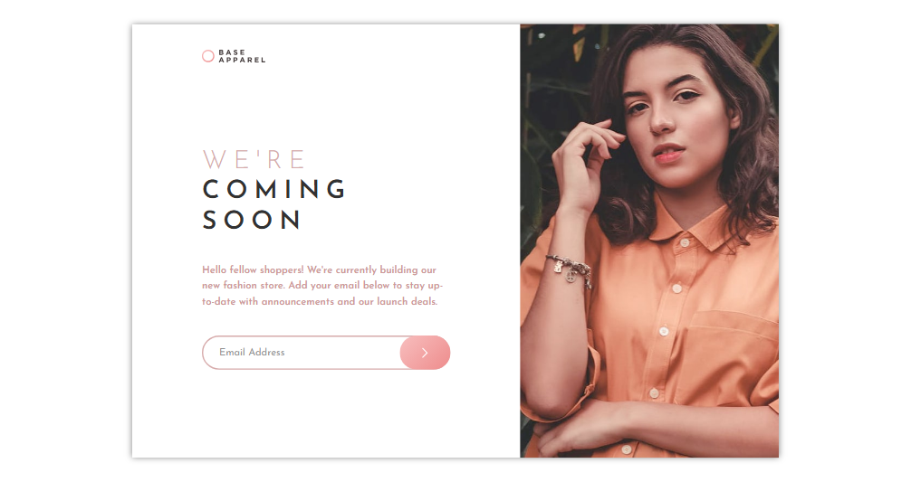
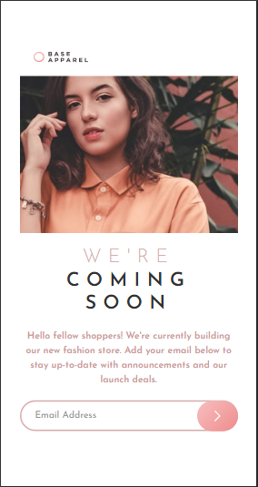
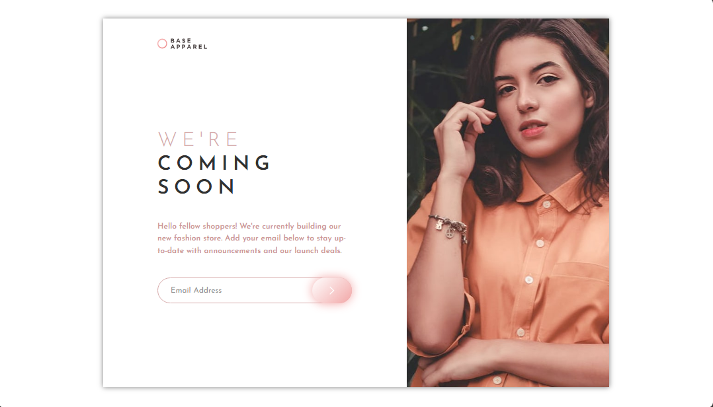

# base-apparel-coming-soon-master
Base apparel coming soon master

This is a solution to the [base-apparel-coming-soon-master on Frontend Mentor](https://www.frontendmentor.io/challenges/base-apparel-coming-soon-page-5d46b47f8db8a7063f9331a0). Frontend Mentor challenges help you improve your coding skills by building realistic projects. 

## Table of contents

- [Overview](#overview)
  - [Screenshot](#screenshot)
  - [Links](#links)
- [My process](#my-process)
  - [Built with](#built-with)
  - [What I learned](#what-i-learned)
  - [Continued development](#continued-development)
- [Author](#author)

## Overview

### Screenshot

These are my screenshots showing how the project turned out.

- Desktop design:



- Mobile design:



- Active state:



- Error message:


### Links

- Solution URL: [My Solution](https://github.com/gillaercio/base-apparel-coming-soon-master)

## My process

### Built with

- Semantic HTML5 markup
- CSS custom properties
- Grid Layout
- Mobile-first workflow
- JavaScript

### What I learned

I took advantage of this project to practice using **clamp()** with **CSS** and **preventDefault()** and **RegExp** with **JavaScript**:

Resizing fonts with clamp()

```css
.title-content {
  padding-left: 0;
  font-size: clamp(2.8rem, 2.8rem + 1.666vw, 4rem);
}

.paragraph-content, .email {
  font-size: clamp(1.4rem, 1.4rem + 1.666vw, 1.6rem);
}
```

Avoiding send message before initial validation

```js
function sendButton(event) {
  event.preventDefault();
// ...
```

Regular Expressions (RegExp)

```js
if (email.value.trim() !== "") {
  const emailPattern = /^[^\s@]+@[^\s@]+\.[^\s@]+$/;
  hasError = !emailPattern.test(email.value.trim());
}
```

### Continued development

I would like to improve the use of the **HTML**, **CSS** and **JavaScript**.

## Author

- Frontend Mentor - [@gillaercio](https://www.frontendmentor.io/profile/gillaercio)
- Github - [My Github](https://github.com/gillaercio)
- LinkedIn - [My LinkedIn](https://www.linkedin.com/in/gildman-la%C3%A9rcio/)